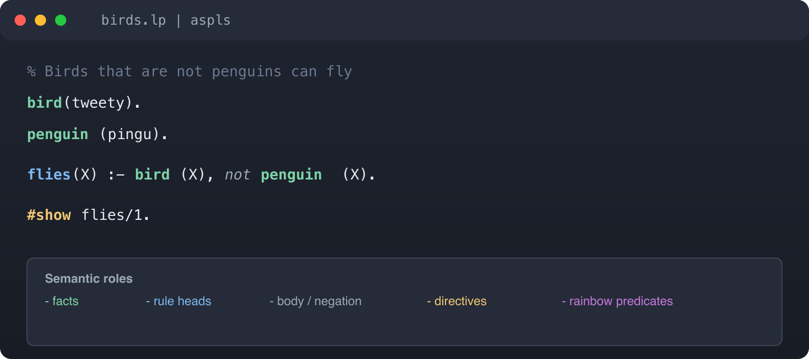

# aspls — Answer Set Programming (Clingo)

<p align="center">
  
</p>

<p align="center">
  <a href="https://marketplace.visualstudio.com/items?itemName=paolaguarasci.aspls"></a>
  <a href="https://open-vsx.org/extension/paolaguarasci/aspls"></a>
  <a href="https://github.com/paolaguarasci/aspls/actions/workflows/ci.yml"></a>
</p>

Language support for **Answer Set Programming** in the ASP-Core-2 / [Clingo](https://potassco.org/clingo/) dialect.

Works with **`.lp`** and **`.asp`** files in VS Code, Cursor, VSCodium, and compatible editors.

**Why aspls:** one extension that combines **language intelligence** (diagnostics, completion, hover, go-to-definition / find-references, semantic + rainbow highlighting, optional learner mode) with a **Clingo runner** (bundled WASM or PATH binary, Solver sidebar). That avoids stacking a highlight-only extension with a separate run-oriented tool.

**Repository:** [github.com/paolaguarasci/aspls](https://github.com/paolaguarasci/aspls)

---

## At a glance

<p align="center">
  
</p>

<p align="center">
  
</p>

---

## Features

| Feature | What you get |
| --- | --- |
| **Run Clingo** | Compute first or all answer sets (editor title buttons, context menu, Command Palette) |
| **ASP sidebar — Solver** | Activity Bar **ASP → Solver**: First / All / Config runs, answer sets, errors, re-run; **Controls** for models, native Clingo path, and additional files |
| **ASP sidebar — Predicates** | **ASP → Predicates**: active-file predicates nested by role → occurrence (powers **Outline**); toolbar **Show Workspace Predicates** |
| **PATH or WASM** | Bundled `clingo-wasm` by default; optional Clingo binary from PATH |
| **Syntax highlighting** | Atoms, variables, comments, directives, operators |
| **Semantic highlighting** | Different colors for facts, rule heads, rule bodies, constraints, `#show`, `#minimize` |
| **Rainbow predicates** | Optional underline color per predicate name (stable across the file) |
| **Diagnostics** | Syntax errors from the ASP parser; optional Clingo-backed checks |
| **IntelliSense** | Predicate completion from the workspace / config file pool |
| **Hover** | Name, arity, occurrence counts; asp-lsp-style `%*…*%` docstrings; definition line + preceding comment |
| **Go to Definition** | Jump to facts and rule heads (cross-file) |
| **Find References** | All occurrences of a predicate in the pool |
| **Learner mode** | Optional rule-order and missing-comment **Information** hints, plus quick fixes (off by default) |
| **Code Cookbook** | Browse working ASP patterns and insert at cursor or open as a new `.lp` file |
| **Snippets** | Templates for `#show`, `#const`, `#minimize`, aggregates, choice rules, weak constraints |

---

## Known limits (ASP grammar subset)

The language server parses a growing **subset** of Clingo / ASP-Core-2. Unsupported constructs get syntax diagnostics even when Clingo itself would accept them.

| Construct | Status |
| --- | --- |
| Facts, rules, integrity constraints | Supported |
| Default negation (`not`) | Supported |
| Comparisons and `#count` / `#sum` / `#max` / `#min` | Supported |
| `#const`, `#show`, `#minimize` | Supported |
| Choice rules `{ … }` | Supported |
| Weak constraints (`:~ … . [w@p, …]`) | Supported |
| `#maximize` | Not yet |
| `#include`, `#external`, `#heuristic`, `#script`, `#program` | Not yet |
| Variable bounds on choice | Supported |

Snippets and the Code Cookbook may show patterns ahead of the parser; prefer this table when diagnostics disagree with Clingo.

---

## Quick start

1. Install **aspls** from the [VS Marketplace](https://marketplace.visualstudio.com/items?itemName=paolaguarasci.aspls) or [Open VSX](https://open-vsx.org/extension/paolaguarasci/aspls).
2. Make sure **Python 3** is available on your PATH (or set `aspls.pythonPath`) for the language server.
3. Open a `.lp` file — the language server starts on first use and sets up a local venv automatically.
4. Click the **play** / **run all** icons in the editor title bar, or use the Command Palette:
   - **aspls: Compute first answer set**
   - **aspls: Compute all answer sets**
5. Results open in the Activity Bar **ASP → Solver** view.

Optional: install [Clingo](https://potassco.org/clingo/) on PATH for extra diagnostics and native solver via `aspls.clingo.usePath`.

---

## Example

```asp
% Birds that are not penguins can fly
bird(tweety).
penguin(pingu).

flies(X) :- bird(X), not penguin(X).

#show flies/1.
```

- **Facts** (`bird`, `penguin`) — bold green
- **Rule head** (`flies`) — bold blue
- **Rule body** — muted; `not penguin` italic when negated
- **`#show`** — gold

---

## Clingo config

Workspace file `aspls.clingo.json` is the **canonical source** for `additionalFiles`, `models`, `threads`, and `customArgs` used by both the language server and the Clingo runner.

Create it with **aspls: Initialize Clingo config file**.

```json
{
  "models": 0,
  "threads": 1,
  "customArgs": "",
  "additionalFiles": ["facts.lp"]
}
```

| `additionalFiles` in config | LSP pool | Runner file set |
| --- | --- | --- |
| Key absent / `null` | Full workspace discovery | Active file only |
| `[]` (explicit empty) | Active file only | Active file only |
| `["a.lp", "b.lp"]` | Active + listed files | Active + listed files |

Path resolution: active file directory → workspace root → active-directory candidate as-is.

`aspls.clingo.additionalFiles` in Settings is **deprecated** — copied only when creating the config file; not read at runtime.

Before every run, aspls **preflights** missing files, invalid `models`, and missing configured PATH binaries.

### Capability matrix (WASM vs PATH)

| Feature | Bundled WASM | Native PATH |
| --- | --- | --- |
| Basic programs / answer sets | yes | yes |
| Multi-file via `additionalFiles` | limited | yes |
| models / `-n` | yes | yes |
| `--const` / `-c` | yes | yes |
| Threads (`-t`) | limited | yes |
| Output control (`--outf`, `-q`, stats) | no | yes |
| Advanced CLI | no | yes |

---

## Docstrings & learner mode

### Predicate docstrings

```asp
%*
#bird(X).

A flying animal (unless it is a penguin).

#parameters
    - X : The individual.
*%

bird(tweety).
```

### Learner mode (`aspls.learnerMode`)

When enabled: **Information** hints for rule order and missing `%` comments, with **Fix Order** and **Add preceding comment** quick fixes.

### onceUsed (`aspls.diagnostics.onceUsed`)

Warns when a predicate appears only once as a **use** (rule body / constraint). Skips lone definitions and `#show` / `#minimize`-linked predicates.

---

## Settings

| Setting | Default | Description |
| --- | --- | --- |
| `aspls.pythonPath` | `""` | Path to Python 3 |
| `aspls.rainbowPredicates` | `true` | Rainbow underline per predicate |
| `aspls.diagnostics.onceUsed` | `true` | Warn on single-use body predicates |
| `aspls.learnerMode` | `false` | Learner Information hints |
| `aspls.clingo.usePath` | `false` | Use PATH instead of WASM |
| `aspls.clingo.path` | `""` | Optional Clingo binary path |
| `aspls.clingo.models` | `1` | Default model count (`0` = all) |
| `aspls.clingo.threads` | `1` | Clingo `-t` |
| `aspls.clingo.customArgs` | `""` | Extra CLI args |
| `aspls.clingo.additionalFiles` | `[]` | **Deprecated** (init migration only) |
| `aspls.clingo.configFile` | `aspls.clingo.json` | Config file name |

---

## Release checklist (maintainers)

Before a Marketplace / Open VSX release after pool or runner changes:

1. `npm test` in `client/`
2. `pytest` in `server/`
3. Manual: `additionalFiles: []` → file-local analysis; remove key → workspace pool
4. Manual: missing `additionalFiles` path → Solver preflight error
5. Manual: WASM + fragile `customArgs` → capability warning; `usePath` → warning gone
6. Manual: edit `aspls.clingo.json` while `.lp` open → diagnostics refresh

Publish:

```bash
npm run publish:marketplace
npm run publish:openvsx
```

---

## Feedback

Issues and contributions: [github.com/paolaguarasci/aspls](https://github.com/paolaguarasci/aspls).

## License

MIT © Paola Guarasci
