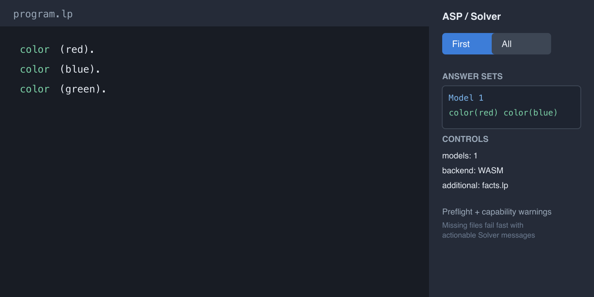
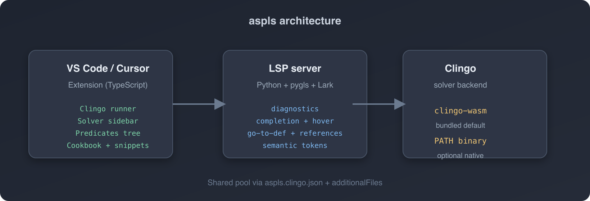

<p align="center">
  
</p>

<h1 align="center">aspls</h1>

<p align="center">
  <strong>Answer Set Programming for VS Code, Cursor, and VSCodium</strong><br/>
  Language intelligence + Clingo runner in one extension · ASP-Core-2 / <a href="https://potassco.org/clingo/">Clingo</a>
</p>

<p align="center">
  <a href="https://github.com/paolaguarasci/aspls/actions/workflows/ci.yml"></a>
  <a href="https://marketplace.visualstudio.com/items?itemName=paolaguarasci.aspls"></a>
  <a href="https://open-vsx.org/extension/paolaguarasci/aspls"></a>
  <a href="https://opensource.org/licenses/MIT"></a>
  
  
  
</p>

<p align="center">
  <a href="https://marketplace.visualstudio.com/items?itemName=paolaguarasci.aspls"><strong>Install on VS Marketplace</strong></a>
  &nbsp;·&nbsp;
  <a href="https://open-vsx.org/extension/paolaguarasci/aspls"><strong>Install on Open VSX</strong></a>
  &nbsp;·&nbsp;
  <a href="https://github.com/paolaguarasci/aspls/issues"><strong>Report issue</strong></a>
</p>

---

**aspls** is a VS Code / Cursor / VSCodium extension for **Answer Set Programming** in the ASP-Core-2 / [Clingo](https://potassco.org/clingo/) dialect. It combines **language intelligence** (diagnostics, completion, hover, go-to-definition, find-references, semantic + rainbow highlighting) with a **Clingo runner** (bundled WASM or PATH binary, Solver sidebar) — so you do not need a highlight-only extension plus a separate run tool.

Works with **`.lp`** and **`.asp`** files.

## Screenshots

### Semantic highlighting

Facts, rule heads, negation, and directives each get distinct colors. Optional rainbow underlines keep predicate names visually distinct across a file.

<p align="center">
  
</p>

### ASP Solver sidebar

Run Clingo from the editor title bar or the **ASP → Solver** view. Answer sets, errors, and re-run controls stay in the sidebar; **Controls** persist models, native Clingo path, and additional files.

<p align="center">
  
</p>

### Architecture

The TypeScript extension hosts the Clingo runner and UI; a Python LSP server provides parsing and IDE features. Both share the same file **pool** via `aspls.clingo.json`.

<p align="center">
  
</p>

## Features

| Feature | What you get |
| --- | --- |
| **Run Clingo** | Compute first or all answer sets (title bar, context menu, Command Palette) |
| **ASP → Solver** | First / All / Config runs, answer sets, errors, re-run; Controls for models, PATH, `additionalFiles` |
| **ASP → Predicates** | Active-file predicates by role; optional workspace pool toggle; powers **Outline** |
| **PATH or WASM** | Bundled `clingo-wasm` by default; optional Clingo binary from PATH |
| **Syntax highlighting** | Atoms, variables, comments, directives, operators |
| **Semantic highlighting** | Facts, rule heads, bodies, constraints, `#show`, `#minimize` |
| **Rainbow predicates** | Optional stable underline color per predicate name |
| **Diagnostics** | ASP parser syntax errors; optional Clingo-backed checks |
| **IntelliSense** | Predicate completion from workspace / config pool |
| **Hover** | Arity, counts, `%*…*%` docstrings, definition line + preceding comment |
| **Go to Definition** | Facts and rule heads (cross-file) |
| **Find References** | All occurrences of a predicate in the pool |
| **Learner mode** | Optional rule-order and comment hints with quick fixes (off by default) |
| **Code Cookbook** | Browse ASP patterns; insert at cursor or open as new `.lp` |
| **Snippets** | Templates for directives, aggregates, choice rules, weak constraints |

## Quick start

1. Install from the [VS Marketplace](https://marketplace.visualstudio.com/items?itemName=paolaguarasci.aspls) or [Open VSX](https://open-vsx.org/extension/paolaguarasci/aspls).
2. Ensure **Python 3** is on your PATH (or set `aspls.pythonPath`). The language server creates a local venv on first use.
3. Open a `.lp` file.
4. Click **play** / **run all** in the editor title bar, or run:
   - `aspls: Compute first answer set`
   - `aspls: Compute all answer sets`
5. Results appear in **ASP → Solver** (sidebar focuses after a run).

Optional: install [Clingo](https://potassco.org/clingo/) on PATH for extra diagnostics and native multi-file runs via `aspls.clingo.usePath`.

## Example

```asp
% Birds that are not penguins can fly
bird(tweety).
penguin(pingu).

flies(X) :- bird(X), not penguin(X).

#show flies/1.
```

| Element | Semantic role |
| --- | --- |
| `bird`, `penguin` | Facts — green |
| `flies` (head) | Rule head — blue |
| `not penguin` | Negation in body — muted / italic |
| `#show` | Directive — gold |

## Tutorial examples

Progressive tutorials under [`examples/`](examples/). Open a file in the editor and run Clingo from the title bar or **ASP → Solver**.

| Tutorial | Path | Topic |
| --- | --- | --- |
| **1 — Basics** | [`examples/01_basics/birds.lp`](examples/01_basics/birds.lp) | Facts, rules, default negation |
| **2 — Choice** | [`examples/02_choice/menu.lp`](examples/02_choice/menu.lp) | Choice rules (pick exactly one) |
| **3 — Optimization** | [`examples/03_optimization/budget.lp`](examples/03_optimization/budget.lp) | `#minimize` and hard constraints |
| **4 — Multi-file** | [`examples/04_multi_file/rules.lp`](examples/04_multi_file/rules.lp) | Pool via `aspls.clingo.json` + `additionalFiles` |

Reference catalogs (grammar coverage, not tutorials): [`grammar_tour.lp`](examples/grammar_tour.lp), [`test.lp`](examples/test.lp).

## Clingo config

Workspace file **`aspls.clingo.json`** (name configurable via `aspls.clingo.configFile`) is the **canonical source** for `additionalFiles`, `models`, `threads`, and `customArgs` for both the LSP and the runner.

Create it with **`aspls: Initialize Clingo config file`**. Legacy `aspls.clingo.additionalFiles` in Settings is copied once on init — not read at runtime.

```json
{
  "models": 0,
  "threads": 1,
  "customArgs": "",
  "additionalFiles": ["facts.lp"]
}
```

Then run **`aspls: Compute answer sets (config)`**. Paths in `additionalFiles` resolve relative to the active file, then the workspace root.

| `additionalFiles` in config | LSP pool | Runner file set |
| --- | --- | --- |
| Key absent / `null` | All `.lp` / `.asp` in workspace | Active file only |
| `[]` (explicit empty) | Active file only | Active file only |
| `["a.lp", "b.lp"]` | Active + listed files | Active + listed files |

> An explicit `[]` means “analyse/run this file in isolation” — not “no config”. That prevents surprising cross-file symbol leakage.

Before every run, aspls **preflights** the request: missing `additionalFiles`, invalid `models`, and a configured but missing `aspls.clingo.path` fail immediately in the Solver panel.

### WASM vs PATH

| Feature | Bundled WASM | Native PATH |
| --- | --- | --- |
| Basic programs / answer sets | yes | yes |
| Multi-file via `additionalFiles` | limited (concatenated) | yes |
| `models` / `-n` | yes | yes |
| `--const` / `-c` | yes | yes |
| Threads (`-t`) | limited | yes |
| Output control (`--outf`, `-q`, stats) | no | yes |
| Advanced CLI (parallel-mode, Lua, limits) | no | yes |

When WASM cannot honor `customArgs`, the Solver shows a **capability warning** and suggests `aspls.clingo.usePath`.

## Grammar coverage

The LSP parses a growing **subset** of Clingo / ASP-Core-2. Unsupported constructs may show syntax diagnostics even when Clingo accepts them.

| Construct | Status |
| --- | --- |
| Facts, rules, integrity constraints | Supported |
| Default negation (`not`) | Supported |
| Comparisons, `#count` / `#sum` / `#max` / `#min` | Supported |
| `#const`, `#show`, `#minimize` | Supported |
| Choice rules `{ … }` | Supported |
| Weak constraints (`:~ … . [w@p, …]`) | Supported |
| Variable bounds on choice | Supported |
| `#maximize` | Not yet |
| `#include`, `#external`, `#heuristic`, `#script`, `#program` | Not yet |

Prefer this table when diagnostics disagree with Clingo. Snippets and the Cookbook may preview patterns ahead of the parser.

## Docstrings & learner mode

Document predicates with asp-lsp-style blocks:

```asp
%*
#bird(X).

A flying animal (unless it is a penguin).

#parameters
    - X : The individual.
*%

bird(tweety).
```

With **`aspls.learnerMode`** enabled, Information hints suggest rule order and missing `%` comments, with **Fix Order** and **Add preceding comment** quick fixes.

**`aspls.diagnostics.onceUsed`** warns when a predicate appears only once as a body/constraint use (likely typo). Lone definitions and `#show` / `#minimize`-linked predicates are skipped.

## Settings

| Setting | Default | Description |
| --- | --- | --- |
| `aspls.pythonPath` | `""` | Python 3 path; empty = auto-detect |
| `aspls.rainbowPredicates` | `true` | Rainbow underline per predicate |
| `aspls.diagnostics.onceUsed` | `true` | Warn on single-use body predicates |
| `aspls.learnerMode` | `false` | Rule order + comment hints |
| `aspls.clingo.usePath` | `false` | Use PATH / `aspls.clingo.path` instead of WASM |
| `aspls.clingo.path` | `""` | Optional absolute Clingo binary path |
| `aspls.clingo.models` | `1` | Default models for config runs (`0` = all) |
| `aspls.clingo.threads` | `1` | Clingo `-t` threads |
| `aspls.clingo.customArgs` | `""` | Extra CLI args |
| `aspls.clingo.additionalFiles` | `[]` | **Deprecated** — migrated on init only |
| `aspls.clingo.configFile` | `aspls.clingo.json` | Workspace config file name |

Semantic highlighting for ASP is enabled by default for `[asp]`.

## Repository layout

| Path | Purpose |
| --- | --- |
| [`client/`](client/) | Publishable VS Code extension (TypeScript) |
| [`server/`](server/) | Python LSP server (pygls, Lark) |
| [`examples/`](examples/) | Tutorial projects + grammar reference files |
| [`docs/images/`](docs/images/) | README illustrations |

The extension README for Marketplace / Open VSX lives in [`client/README.md`](client/README.md).

## Development

### Prerequisites

- Node.js 20+
- Python 3.12+
- Optional: [Clingo](https://potassco.org/clingo/) on PATH for PATH smoke tests

### Client

```bash
cd client
npm ci
npm test          # unit + regression + WASM/PATH smoke
npm run compile
```

### Server

```bash
cd server
pip install pytest==8.3.3 pygls==1.3.1 lark==1.2.2 clingo
PYTHONPATH=. pytest -q
```

CI runs both jobs on every push/PR to `main` / `master` — see [`.github/workflows/ci.yml`](.github/workflows/ci.yml).

### Extension development

Open the repo in VS Code, run the **Run Extension** launch config from [`client/.vscode/launch.json`](client/.vscode/launch.json), or:

```bash
npm run compile   # from repo root
```

### Publish (maintainers)

```bash
npm run publish:marketplace   # VS Marketplace
npm run publish:openvsx       # Open VSX
```

See [`client/README.md`](client/README.md) for the release checklist.

## Contributing

Issues and pull requests are welcome at [github.com/paolaguarasci/aspls](https://github.com/paolaguarasci/aspls).

## License

MIT © [Paola Guarasci](https://github.com/paolaguarasci)
